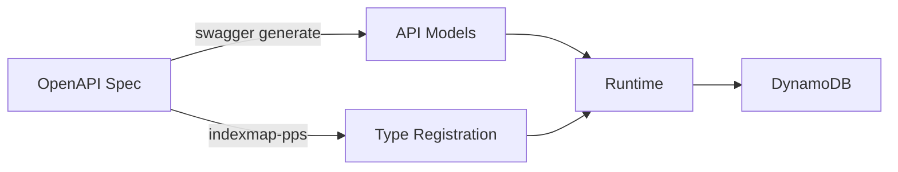

# EntityStore Library Usage Guide

## Overview

The EntityStore library provides a type-safe, annotation-driven approach to DynamoDB integration in the Suparena API. It bridges OpenAPI specifications with DynamoDB storage through code generation and type registration.

## Table of Contents

1. [How It Works](#how-it-works)
2. [OpenAPI Annotations](#openapi-annotations)
3. [Code Generation Process](#code-generation-process)
4. [Type Registration](#type-registration)
5. [Runtime Usage](#runtime-usage)
6. [Best Practices](#best-practices)
7. [Troubleshooting](#troubleshooting)

## How It Works

The EntityStore system operates in three phases:

1. **Design Time**: Add `x-dynamodb-indexmap` annotations to OpenAPI models
2. **Build Time**: Generate type registration code via `generate-server.sh`
3. **Runtime**: Use registered types with type-safe DataStore operations



## OpenAPI Annotations

### Basic Annotation Structure

Add the `x-dynamodb-indexmap` vendor extension to any model definition:

```yaml
UserProfile:
  type: object
  x-dynamodb-indexmap:
    PK: "USER#{UserId}"    # Primary Key pattern
    SK: "PROFILE"          # Sort Key pattern
  properties:
    UserId:
      type: string
    Name:
      type: string
```

### Index Pattern Syntax

#### 1. **Field Reference**: `{FieldName}`
```yaml
x-dynamodb-indexmap:
  PK: "{CompetitionID}"  # Uses the CompetitionID field value
  SK: "{ID}"             # Uses the ID field value
```

#### 2. **Composite Keys**: Combine static text with field values
```yaml
x-dynamodb-indexmap:
  PK: "USER#{UserId}"    # Results in: USER#12345
  SK: "PROFILE"          # Static value
```

#### 3. **Global Secondary Indexes**: Use PK1/SK1, PK2/SK2, etc.
```yaml
x-dynamodb-indexmap:
  PK: "{CompetitionID}"
  SK: "{ID}"
  PK1: "{AthleteID}"     # GSI1 Primary Key
  SK1: "{AthleteID}"     # GSI1 Sort Key
```

### Real Examples from the Codebase

#### Player Model
```yaml
Player:
  type: object
  x-dynamodb-indexmap:
    PK: "{CompetitionID}"
    SK: "{ID}"
    PK1: "{AthleteID}"
    SK1: "{AthleteID}"
```

#### Match Model
```yaml
Match:
  type: object
  x-dynamodb-indexmap:
    PK: "{CompetitionID}"
    SK: "{ID}"
    PK1: "{EventID}"
    SK1: "{ID}"
```

## Code Generation Process

### 1. Run the Generation Script

```bash
cd /Users/jonzhu/projects/api.suparena.net/openapi
./generate-server.sh
```

This script performs two operations:

1. **Swagger Generation**: Creates API server code
   ```bash
   swagger generate server -A suparena-backend -P models.Principal -f openapi.yaml -t .
   ```

2. **EntityStore Post-Processing**: Generates type registration
   ```bash
   ../bin/indexmap-pps -in=openapi.yaml -outputdata=./models/indexmap_type_registration.go
   ```

### 2. Generated Registration Code

The post-processor creates `indexmap_type_registration.go`:

```go
func init() {
    // Register index map for model UserProfile
    registry.RegisterIndexMap[UserProfile](func() map[string]string {
        return map[string]string{
            "PK": "USER#{UserId}",
            "SK": "PROFILE",
        }
    }())
    
    // Register type registry for model UserProfile
    registry.RegisterType("UserProfile", func(item map[string]types.AttributeValue) (interface{}, error) {
        obj := &UserProfile{}
        err := attributevalue.UnmarshalMap(item, obj)
        return obj, err
    })
}
```

## Type Registration

### Automatic Registration (OpenAPI Models)

For models defined in `openapi.yaml` with `x-dynamodb-indexmap`:

1. Add the annotation to your model
2. Run `./generate-server.sh`
3. The type is automatically registered

### Manual Registration (Core Types)

For types not in the OpenAPI spec (e.g., in the `core` package):

1. Create or edit `core/indexmap_type_registration.go`
2. Add registration code:

```go
func init() {
    // Register index map
    registry.RegisterIndexMap[UserProfile](func() map[string]string {
        return map[string]string{
            "PK": "USER#{UserId}",
            "SK": "PROFILE",
        }
    }())
    
    // Register type with package-qualified name
    registry.RegisterType("core.UserProfile", func(item map[string]types.AttributeValue) (interface{}, error) {
        obj := &UserProfile{}
        err := attributevalue.UnmarshalMap(item, obj)
        return obj, err
    })
}
```

### Registration Key Conventions

- **OpenAPI models**: Use simple type name (e.g., `"UserProfile"`)
- **Core package types**: Use package-qualified name (e.g., `"core.UserProfile"`)

## Runtime Usage

### 1. Initialize Storage Manager

```go
storage = entitystore.NewStorageManager()

// Create and register datastores
userStore, err := ddb.NewDynamodbDataStore[models.UserProfile](
    dynamoClient,
    tableName,
    "UserProfile", // Entity type name
)
storage.RegisterDataStore("models.UserProfile", userStore)
```

### 2. Use in Services

```go
// Get the datastore
ds, err := storage.GetDataStore("models.UserProfile")
if err != nil {
    return err
}

// Type assert to get type-safe operations
userStore, ok := ds.(datastore.DataStore[*models.UserProfile])
if !ok {
    return fmt.Errorf("invalid datastore type")
}

// Perform operations
profile := &models.UserProfile{
    UserId: "12345",
    Name: "John Doe",
}
err = userStore.Put(ctx, profile)
```

### 3. Query Operations

```go
// Get by key
profile, err := userStore.GetOne(ctx, userId)

// Query with conditions
params := &storagemodels.QueryParams{
    KeyCondition: "PK = :pk",
    ExpressionAttributeValues: map[string]types.AttributeValue{
        ":pk": &types.AttributeValueMemberS{Value: "USER#12345"},
    },
}
results, err := userStore.Query(ctx, params)
```

## Best Practices

### 1. Index Design

- **Use composite keys** for hierarchical data:
  ```yaml
  PK: "COMP#{CompetitionID}"
  SK: "EVENT#{EventID}"
  ```

- **Design for access patterns**: Consider your query needs when designing indexes

- **Limit GSIs**: Each GSI costs additional write capacity

### 2. Field Naming

- **Be consistent**: Use the same field names across models
- **Avoid conflicts**: Don't use DynamoDB reserved words
- **Case sensitivity**: DynamoDB is case-sensitive; be consistent

### 3. Type Registration

- **Package qualification**: Always use package-qualified names for non-OpenAPI types
- **Init ordering**: Ensure registration happens before usage
- **Error handling**: Check type assertions when using datastores

### 4. Performance

- **Use batch operations** when possible
- **Cache frequently accessed data** in Redis
- **Design indexes to avoid scans**

## Troubleshooting

### Common Issues

#### 1. "Type not registered" Error
```
Error: type "UserProfile" not registered
```

**Solution**: Ensure the type is registered in either:
- `openapi/models/indexmap_type_registration.go` (for OpenAPI models)
- `core/indexmap_type_registration.go` (for core types)

#### 2. "Invalid datastore type" Error
```
Error: invalid datastore type
```

**Solution**: Check that:
- The datastore is registered with the correct type name
- Type assertion matches the registered type (pointer vs value)

#### 3. Index Pattern Not Working
```
Error: unable to construct key from pattern
```

**Solution**: Verify that:
- Field names in the pattern match the struct tags
- Required fields are populated before saving

### Debugging Tips

1. **Check registration**: Add debug logging in init() functions
2. **Verify patterns**: Log the generated keys before DynamoDB operations
3. **Test indexes**: Use AWS CLI to verify data structure in DynamoDB

## Examples

### Adding a New Entity

1. **Define in OpenAPI**:
```yaml
TeamProfile:
  type: object
  x-dynamodb-indexmap:
    PK: "TEAM#{TeamId}"
    SK: "PROFILE"
    PK1: "SPORT#{Sport}"
    SK1: "TEAM#{TeamId}"
  properties:
    TeamId:
      type: string
    Name:
      type: string
    Sport:
      type: string
```

2. **Generate code**:
```bash
cd openapi && ./generate-server.sh
```

3. **Use in service**:
```go
teamStore, _ := storage.GetDataStore("models.TeamProfile")
team := &models.TeamProfile{
    TeamId: "team123",
    Name: "Thunder Bolts",
    Sport: "TableTennis",
}
teamStore.Put(ctx, team)
```

## References

- [EntityStore GitHub Repository](https://github.com/suparena/entitystore)
- [DynamoDB Best Practices](https://docs.aws.amazon.com/amazondynamodb/latest/developerguide/best-practices.html)
- [OpenAPI Specification Extensions](https://swagger.io/specification/#specification-extensions)